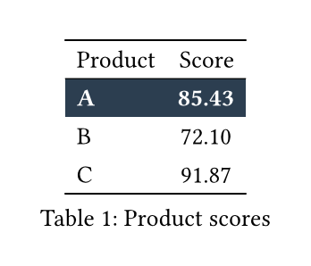

# tytable

A small Python library that turns **Polars DataFrames** into **Typst tables**, inspired by R's [`tinytable`](https://github.com/vincentarelbundock/tinytable) package. Most of tinytable's styling power, including image/sparkline support and a Jupyter HTML preview.

## Install

Install the latest release from [PyPI](https://pypi.org/project/tytable/):

```
uv add tytable
```

Or with pip:

```
pip install tytable
```

Tytable-generated `.typ` fragments require **Typst 0.11.1 or newer** to compile. The published documentation PDF is built with Typst 0.15.0.

For generated plots and sparklines, install the optional extra. Embedding existing image files with `.images()` needs no additional Python dependencies:

```
uv add "tytable[images]"
```

From a cloned checkout, run:

```
uv sync --all-extras
make test
```

## Quickstart

```python
import polars as pl
from tytable import tt

df = pl.DataFrame({
    "Product": ["A", "B", "C"],
    "Score": [85.43, 72.10, 91.87],
})

tab = (
    tt(df, caption="Product scores", label="product-scores")
    .fmt(j="Score", digits=2)
    .style(j="Score", align="c")
    .style(i=0, bold=True, background="#2c3e50", color="white")
)

# Save in a script, or let `tab` be the last line of a Jupyter cell for a preview.
tab.save("report_assets/products.typ")
tab
```



The `.typ` file can be `#include`d in a Typst report and compiled as part of the whole document.

## Conventions

- **Semantic row selection**: non-negative `i` values are stable 0-based source DataFrame positions, even after row groups are inserted. Omitting `i` (or using `i="data"`) selects all source rows. Use `i="header"`, `i="groupi"`, `i="groupj"`, or `i="all"` for explicit structural selections. Styling supports every grid row. Formatting and targeted notes support data, row-group, and column-name rows; plots and images support data and row-group rows. Unsupported structural targets raise a clear error when rendered.
- **Column selection**: use original DataFrame names (`j="Score"`) or 0-based positions (`j=0`); display names are presentation-only.
- **Method chaining**: `.style()`, `.fmt()`, `.group()`, and the `.theme_*()` methods all return `self`. `.render()` / `.save()` are terminal.
- **Readable defaults**: text columns are left-aligned and numeric columns are right-aligned, including their headers. Explicit `.style(align=...)` calls override these dtype-based defaults.
- **Lazy evaluation**: styling, formatting, grouping, and plotting are recorded as _intent_ and replayed in a fixed order at render time.
- **Figure wrapping**: Typst tables are figures by default, enabling captions, numbering, and labels such as `label="product-scores"`. Use `figure=False` for an unnumbered table; captions and labels cannot be combined with it.

## Documentation

A practical guide with **rendered examples** (source followed by result) from easy to complex, a **task-oriented API reference**, and an R-tinytable comparison table live in the PDF built from [`docs/main.typ`](docs/main.typ):

- **Always-current build (HEAD):** <https://einmaulwurf.github.io/tytable/>
- **Versioned (latest release):** <https://github.com/EinMaulwurf/tytable/releases/latest/download/tytable-docs.pdf>

Build locally (requires the `typst` CLI, install from [here](https://typst.app/open-source)):

```
make docs
# → docs/tytable-docs.pdf
```

Documented public APIs remain backward compatible throughout each major release series. After version 2.0, further breaking changes are reserved for 3.0.

## Coming from R tinytable

`tt(df)` ↔ `tt(data)`, `.style()` ↔ `style_tt()`, `.fmt()` ↔ `format_tt()`, `.group()` ↔ `group_tt()`, and `.theme_striped()` / `.theme_grid()` correspond to `theme_tt()`. Indexing is **0-based** (vs R's 1-based) and columns are selected by **name** (preferred). The full comparison table is in the PDF above.
